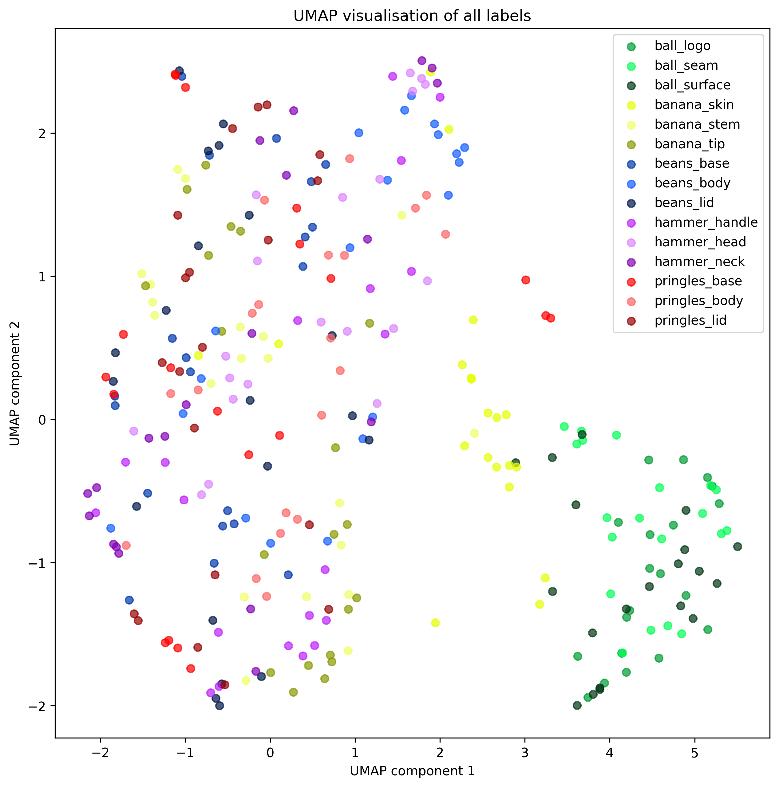

# Visuo-Tactile-Clustering

## Overview

**Visuo-Tactile-Clustering** is a set of scripts for analysing and visualising tactile data collected from a visuo-tactile sensor. The scripts perform the following tasks:

- Load and preprocess tactile images from a visuo-tactile sensor.
- Extract features and perform dimensionality reduction (PCA, t-SNE, UMAP).
- Cluster tactile data to explore how different object parts group together.
- Evaluate clustering quality using visualisations and silhouette scores.



The example dataset was collected using a [DIGIT](https://digit.ml/) tactile sensor, capturing interactions with 5 different objects. For each object, 20 tactile images were recorded from 3 distinct parts, enabling analysis of how well the clustering methods can distinguish between object parts based on tactile features.

- The raw tactile data is located in the `data` folder.
- Generated plots are saved in the `plots` folder.
- Generated tactile thumbnails are saved in the `thumbnails` folder.

Two different approaches are used for comparison: a basic approach and a machine learning approach. The basic approach flattens each image into a one-dimensional array of pixel values. The machine learning approach uses a pre-trained ResNet feature extraction model to generate feature vectors from the images before clustering.

## Requirements

- **Operating System:** Windows, Mac, Linux
- **Tested Environment:** Ubuntu 22.04, Python 3.10.12 
- **Python Environment:** Regular Python or Anaconda environment
- **Packages:** See `requirements.txt`

## Installation

### 1. Clone the repository

```bash
git clone https://github.com/gemixin/visuo-tactile-clustering.git
cd visuo-tactile-clustering
```

### 2. Install dependencies

#### Option A: With pip

1. **(Optional) Set up a virtual environment:**
    ```bash
    python3 -m venv venv
    source venv/bin/activate
    ```

2. **Install the required package:**  
    ```bash
    pip install -r requirements.txt
    ```

#### Option B: With Anaconda

Create a new conda environment using the provided `environment.yml`:

```bash
conda env create -f environment.yml
conda activate visuo-tactile-clustering
```

## Running the Scripts
### Thumbnails
Creates thumbnail images from the raw tactile data for quick visual inspection and dataset overview.
```bash
python3 generate_thumbnails.py
```

### Basic Clusters
Performs clustering on the tactile images using the basic approach (flattened pixel arrays), applies dimensionality reduction, and evaluates clustering quality. Outputs plots and silhouette scores.
```bash
python3 basic_clusters.py
```

###  ML Clusters
Performs clustering using the machine learning approach (feature extraction with a pre-trained model), applies dimensionality reduction, and evaluates clustering quality. Outputs plots and silhouette scores.
```bash
python3 ml_clusters.py
```

## Data
The following 5 objects were used for the example dataset: a Pringles tube, a banana, a hammer, a tennis ball and a tin of beans.


## Analysis
Clustering performance is weak with the example dataset, which is expected due to the small sample size and high intra-object variance. Additionally, the machine learning feature extraction model is not trained on tactile images, which may further limit clustering quality.